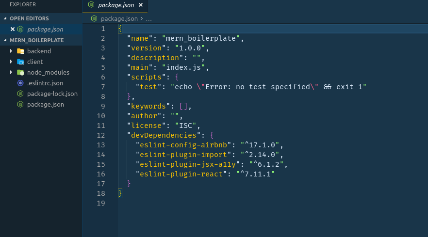

# Create a MERN app boilerplate

Quite too often we rely on CLI's to help us bootstrap our projects, while this is a great step towards reducing your development time, and cutting down on the amount of stress it takes to understand the technicalities involved, that is if you are new to the technology...
You would discover as you progress and gain mastery of the art and tech that there begins to well up a need to understand what is happening behind the scene. I've been in these places all through my coding journey, and if you are then this post is for you.

## What you will learn

In this post, am going to show you how to build a MERN (Mongodb, Express, React, Node) boilerplate from scratch. If you have ever used `express generator` or `create-react-app` you will relate better with this.

I will be trying my best to show you how and what is happening behind the scene so you extend and do what ever you like after knowing the basis.

## The Future

Prior to [create react app v2](https://github.com/facebook/create-react-app/releases), there were some reasons developers `ejected` from the default CRA bootstrapping. I had mine as well, one of them being the inability to use [sass](https://sass-lang.com/). This limitation drove me to find other ways of setting up CRA.

Alright let's get to work 👍

Open your terminal and run this command

```sh
$ mkdir mern_boilerplate && cd mern_boilerplate
```

Next you create a couple directories.

```
$ mkdir client backend
```

From the root of your project run `npm init -y`. The `-y` flag will automatically answer yes to all the prompts.

Good work. I like to have a single `npm` file where I manage all dependencies. I can't say what's right or wrong about the approach, you could choose to manage your dependencies within thier separate directories.

---

Now let's start pulling in our dependencies.

Your directory tree should look like this

```txt
| src
  - backend
  - client
  - package.json
```

### First is ESLINT

You may choose to install this globally or locally.

`npm i -g eslint` or `sudo npm i -g eslint`. To install locally, simply remove the `-g` flag.

In your terminal run this

```
$ eslint --init
```

choose

- Use a popular style guide
- Airbnb
- `Do you use React?` type `yes` or `y`
- JSON

It automatically checks for peer dependencies and downloads them.

Now your `package.json` should look like this



while your `.eslintrc.json` should have the following

```json
{
  "extends": "airbnb"
}
```

For the sake of this project we will update our `.eslintrc.json` file to have the code below.

```json
{
  "extends": [
    "eslint:recommended"
  ],
  "plugins": [
    "react",
    "jsx-a11y",
    "import"
  ],
  "parserOptions": {
    "ecmaVersion": 6,
    "sourceType": "module",
    "ecmaFeatures": {
      "jsx": true,
      "modules": true,
      "experimentalObjectRestSpread": true
    }
  },
  "rules": {
    "no-unused-vars": "off",
    "react/jsx-filename-extension": 0,
    "semi": "off",
    "no-undef": "off",
    "eol-last": "off",
    "import/no-named-as-default": 0,
    "import/no-named-as-default-member": 0,
    "comma-dangle": "off",
    "no-console": "off"
  },
  "parser": "babel-eslint"
}
```

The above rules will teach eslint to ignore some rules specified within the `rules` key.

### Babel & Webpack

Now let's go ahead and install [babel](https://babeljs.io/) and [webpack](https://webpack.js.org/).

- `Babel`: is a javascript compiler. It is a toolchain that is mainly used to convert `ECMAScript 2015+` code into a backwards compatible version of JavaScript in current and older browsers or environments. Visit the [Docs](https://babeljs.io/docs/en/) for more information.

- `Webpack`: is a static module bundler for modern JavaScript applications. When webpack processes your application, it internally builds a dependency graph which maps every module your project needs and generates one or more bundles. Visit the [Docs](https://webpack.js.org/concepts/) for more information.

Now run this in your terminal

```sh
$ npm i babel-cli babel-core babel-loader babel-plugin-transform-class-properties babel-preset-env babel-preset-react
```

That's probably a lot of dependencies you may think. This is what babel needs to compile our code properly.

Install `webpack` via the terminal

```
$ npm i webpack webpack-dev-server
```

Now create a file `.babelrc` and register this inside.

```.bablerc
{
  "presets": ["env", "react"],
  "plugins" ["transform-class-properties"]
}
```

The setup above will allow us to use ES6 and `javascript's` spread syntax in our code.

## Configuring Webpack

Create a file `webpack.config.js` in the root of your project and register the following code inside of it.

```js
const path = require('path')
const HtmlWebpackPlugin = require('html-webpack-plugin')

module.exports = {
  entry: "./client/src/index.js",
  output: {
    path: path.resolve(__dirname, "./dist"),
    filename: "index-bundle.js"
  },
  module: {
    rules: [
      {
        test: /\.js$/,
        exclude: /node_modules/,
        loader: "babel-loader"
      },
      {
        test: /\.s?css$/,
        use: ["style-loader", "css-loader", "sass-loader"]
      }
    ]
  },
  plugins: [
    new HtmlWebpackPlugin({
      template: "./client/public/index.html"
    })
  ],
  devtool: "cheap-module-eval-source-map",
  devServer: {
    contentBase: path.resolve(__dirname, "./dist")
  }
}
```

Very good. At the moment our project has some missing dependecies listed in our `webpack.config.js` file. We will fix that by installing those real quick. So head to the terminal and run this:

```sh
$ npm i style-loader css-loader sass-loader
$ npm i --save-dev html-webpack-plugin
```

Great work 🙂. We are almost ready for the `client-side` but we to install `react` and it's peer dependencies

```sh
$ npm i react react-dom react-router-dom
```

Ready??? Let's go 👯

## Client-Side

Now you `cd` into the `client` directory.

```sh
$ mkdir public src
```

Navigate into the public directory and create an `index.html` file. Your new index.html file will contain basic boilerplate code and extra line `<div id="root"></div>` with the body tag.

Next navigate into the `src` directory and create a file `index.js`. Your new index.js file would contain these lines of code:

```jsx
import React from 'react'
import ReactDOM from 'react-dom'
import App from './components/App'

const rootApp = document.getElementById('root')

ReactDOM.render(<App />, rootApp)
```

Now let's create the `App` component. While inside the `src` directory, create a folder `mkdir components` and create a file `App.js` inside `components` folder.

Add these lines inside the App component.

```jsx
import React from 'react'

const App = () => (
  <div>
    <header>Custom Boilerplate</header>
    <main>
      <p>Now our frontEnd is working</p>
    </main>
  </div>
)

export default App
```

Just before we zoom off to the browser to see our new component rendered to the screen. Let's update our `package.json` file so we can run react from the terminal.

There is a `script` key in the package.json file. Add these lines to it.

```json
"scripts": {
  "start": "webpack-dev-server --open --watch --hot",
  "lint": "eslint client/src",
  "build": "webpack",
}
```

Save your work and open the terminal. Now you can run your app with this:

```sh
$ npm start
```

Voila 🍾