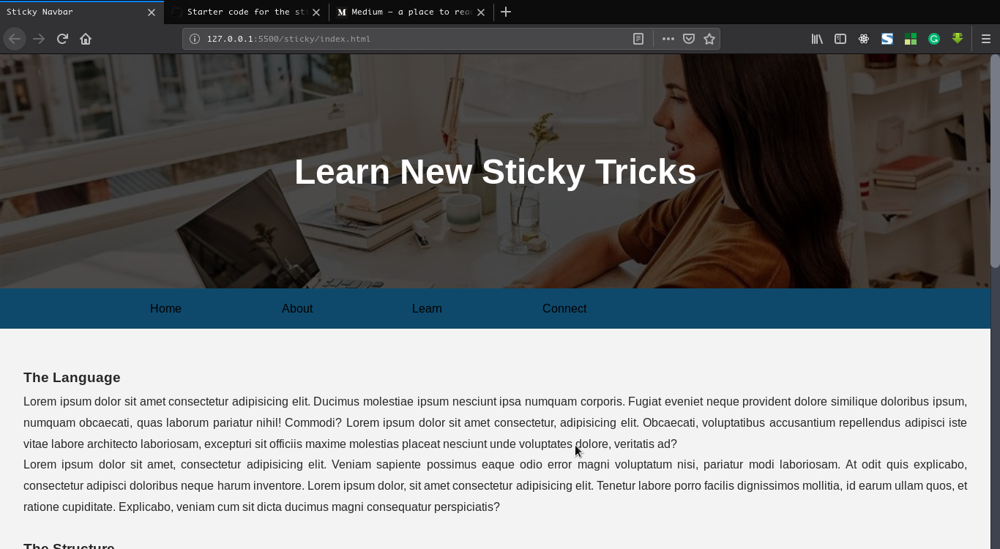
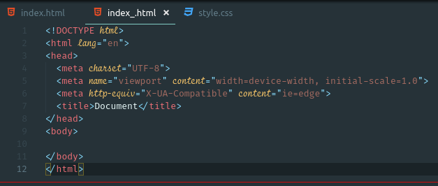
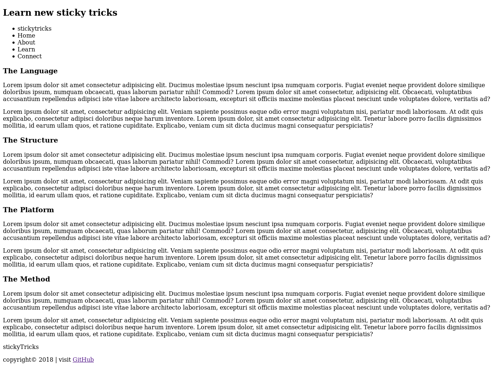
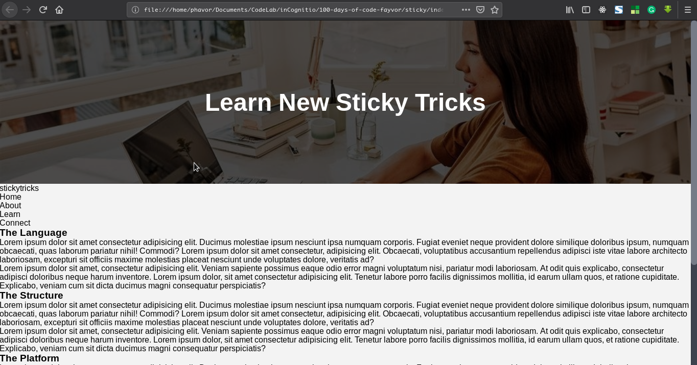
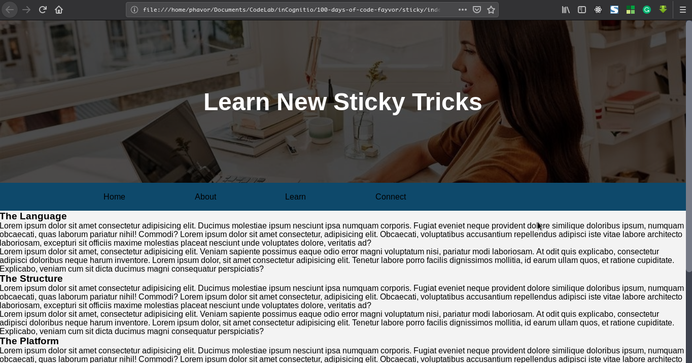
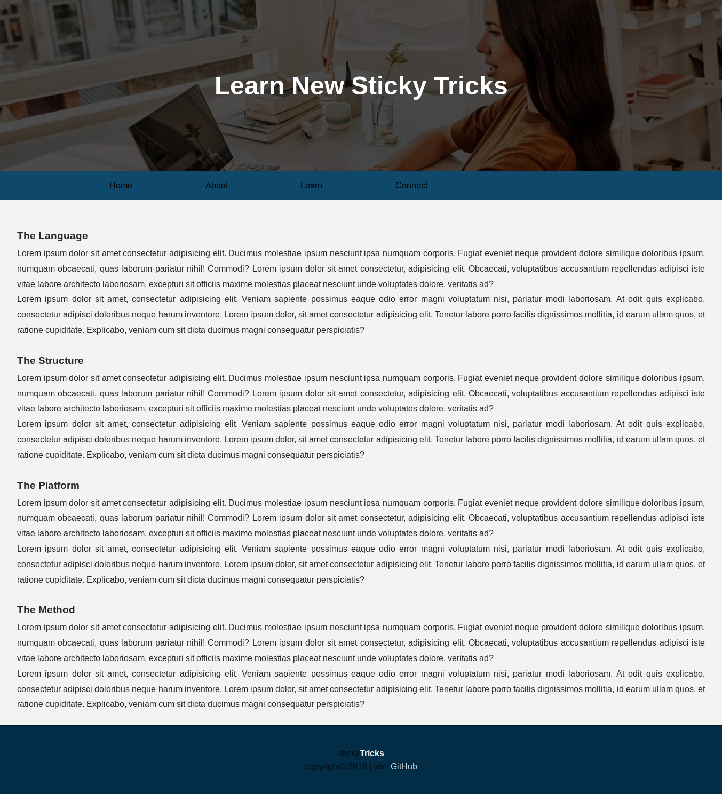
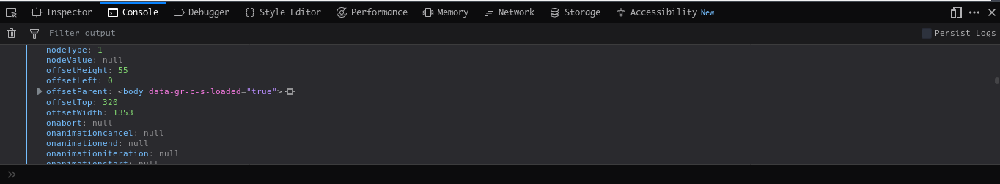

# Creating a simple scroll-fix navbar

I have observed with excitment that some website's header would either change color or be fixed as I scrolled. I wondered, what should be responsible for this? Well I've found something interesting, and I'll share this new finding of mine with you.

## What we are going to build



We are going to build a simple webpage with the navbar below the hero section so that as you scroll down the page, the navbar gets fixed to the top of the browser.

Simple right? Yes it is. The idea is to build simple projects that teach you what you need to know. So let's get it.

## What you need

* vscode
* web browser
* laptop
* rapt attention

---

Setup your directory structure with `index.html`, `style.css` and a `main.js` file.

Open up the `index.html` file with your vscode and key in this `!` then hit the tab key. This should auto generate the boilerplate for you.

It should be looking this good by now



Link up the `style.css` and the `main.js` files

```html
...
    <link rel="stylesheet" href="style.css">
  </head>

  <body>

    <script src="main.js"></script>
  </body>
</html>
```

Now let's add content to our `index.html` file real quick. Within the `<body></body>` tag insert this lines code...

```html
<header>
  <div class="hero">
    <div class="overlay">
      <h2>Learn new sticky tricks</h2>
    </div>
  </div>
</header>
<nav>
  <ul>
    <li class="logo">
      sticky<span>tricks</span>
    </li>
    <li>Home</li>
    <li>About</li>
    <li>Learn</li>
    <li>Connect</li>
  </ul>
</nav>

<section>
  <h3>The Language</h3>
  <p>
    Lorem ipsum dolor sit amet consectetur adipisicing elit. Ducimus molestiae ipsum nesciunt ipsa numquam corporis. Fugiat eveniet neque provident dolore similique doloribus ipsum, numquam obcaecati, quas laborum pariatur nihil! Commodi? Lorem ipsum dolor sit amet consectetur, adipisicing elit. Obcaecati, voluptatibus accusantium repellendus adipisci iste vitae labore architecto laboriosam, excepturi sit officiis maxime molestias placeat nesciunt unde voluptates dolore, veritatis ad?
  </p>

  <p>
    Lorem ipsum dolor sit amet, consectetur adipisicing elit. Veniam sapiente possimus eaque odio error magni voluptatum nisi, pariatur modi laboriosam. At odit quis explicabo, consectetur adipisci doloribus neque harum inventore. Lorem ipsum dolor, sit amet consectetur adipisicing elit. Tenetur labore porro facilis dignissimos mollitia, id earum ullam quos, et ratione cupiditate. Explicabo, veniam cum sit dicta ducimus magni consequatur perspiciatis?
  </p>

  <h3>The Structure</h3>
  <p>
    Lorem ipsum dolor sit amet consectetur adipisicing elit. Ducimus molestiae ipsum nesciunt ipsa numquam corporis.
    Fugiat eveniet neque provident dolore similique doloribus ipsum, numquam obcaecati, quas laborum pariatur nihil!
    Commodi? Lorem ipsum dolor sit amet consectetur, adipisicing elit. Obcaecati, voluptatibus accusantium repellendus
    adipisci iste vitae labore architecto laboriosam, excepturi sit officiis maxime molestias placeat nesciunt unde
    voluptates dolore, veritatis ad?
  </p>

  <p>
    Lorem ipsum dolor sit amet, consectetur adipisicing elit. Veniam sapiente possimus eaque odio error magni voluptatum
    nisi, pariatur modi laboriosam. At odit quis explicabo, consectetur adipisci doloribus neque harum inventore. Lorem
    ipsum dolor, sit amet consectetur adipisicing elit. Tenetur labore porro facilis dignissimos mollitia, id earum ullam
    quos, et ratione cupiditate. Explicabo, veniam cum sit dicta ducimus magni consequatur perspiciatis?
  </p>

  <h3>The Platform</h3>
  <p>
    Lorem ipsum dolor sit amet consectetur adipisicing elit. Ducimus molestiae ipsum nesciunt ipsa numquam corporis.
    Fugiat eveniet neque provident dolore similique doloribus ipsum, numquam obcaecati, quas laborum pariatur nihil!
    Commodi? Lorem ipsum dolor sit amet consectetur, adipisicing elit. Obcaecati, voluptatibus accusantium repellendus
    adipisci iste vitae labore architecto laboriosam, excepturi sit officiis maxime molestias placeat nesciunt unde
    voluptates dolore, veritatis ad?
  </p>

  <p>
    Lorem ipsum dolor sit amet, consectetur adipisicing elit. Veniam sapiente possimus eaque odio error magni voluptatum
    nisi, pariatur modi laboriosam. At odit quis explicabo, consectetur adipisci doloribus neque harum inventore. Lorem
    ipsum dolor, sit amet consectetur adipisicing elit. Tenetur labore porro facilis dignissimos mollitia, id earum ullam
    quos, et ratione cupiditate. Explicabo, veniam cum sit dicta ducimus magni consequatur perspiciatis?
  </p>

  <h3>The Method</h3>
  <p>
    Lorem ipsum dolor sit amet consectetur adipisicing elit. Ducimus molestiae ipsum nesciunt ipsa numquam corporis.
    Fugiat eveniet neque provident dolore similique doloribus ipsum, numquam obcaecati, quas laborum pariatur nihil!
    Commodi? Lorem ipsum dolor sit amet consectetur, adipisicing elit. Obcaecati, voluptatibus accusantium repellendus
    adipisci iste vitae labore architecto laboriosam, excepturi sit officiis maxime molestias placeat nesciunt unde
    voluptates dolore, veritatis ad?
  </p>

  <p>
    Lorem ipsum dolor sit amet, consectetur adipisicing elit. Veniam sapiente possimus eaque odio error magni voluptatum
    nisi, pariatur modi laboriosam. At odit quis explicabo, consectetur adipisci doloribus neque harum inventore. Lorem
    ipsum dolor, sit amet consectetur adipisicing elit. Tenetur labore porro facilis dignissimos mollitia, id earum ullam
    quos, et ratione cupiditate. Explicabo, veniam cum sit dicta ducimus magni consequatur perspiciatis?
  </p>
</section>

<footer>
  <div class="logo_footer">
    sticky<span>Tricks</span> 
  </div>
  <p>copyright&copy; 2018 | visit <a href="http://github.com/phavor" target="_blank">GitHub</a></p>
</footer>
```

Now open it up in your browser, we have to see what we have setup already. Mine looks like this...



Am hoping yours looks just the same.

## Beautify with CSS

Now let's get to the fun part of styling our little project. Open your `style.css` and add these lines to normalize the client code.

```css
* {
  padding: 0;
  margin: 0;
}

body {
  font-family: Arial, Helvetica, sans-serif;
  background: #f3f3f3;
}
```

Now we get to the hero section, you can use any image of your choice... here is the code to insert

```css
.hero {
  background: url('../assets/images/ext.jpeg');
  background-size: cover;
  background-position: center center;
  height: 20rem;
}

.overlay {
  display: flex;
  justify-content: center;
  align-items: center;
  width: 100%;
  height: 100%;
  background: rgba(0, 0, 0, 0.7)
}

.overlay h2 {
  color: white;
  text-transform: capitalize;
  font-size: 3rem;
}
```

Our page should be looking like this with your own picture obviosly



Now we will style our navbar, so insert these code lines in your stylesheet

```css
nav {
  display: flex;
  background: #0e496b;
  width: 100%;
  position: relative;
}

ul {
  display: flex;
  list-style: none;
}

li {
  flex: 1;
  display: flex;
  justify-content: center;
  align-items: center;
  text-align: center;
  padding: 1rem 5vw;
  cursor: pointer;
  transition: all .4s ease-in-out;
}

li:hover {
  color: aliceblue;
  background: #032d46;
}

li.logo {
  max-width: 0;
  overflow: hidden;
  background: #faf3f3;
  transition: all 0.5s;
  font-size: 1.3rem;
  transition: all .3s ease-in-out;
  transform: translateX(-150px); /* pushes the logo off the screen */
}

li.logo span {
  font-weight: 600;
  color: #02121b;
  text-transform: capitalize;
}

li.logo:hover {
  background: #032d46;
}
```

When you preview your page, you should see a blue shaded navigation bar right below the hero section. The `logo` was sent off the screen with the css rule `transform: translateX(-150px);`



Next we take our attention to the text elements and give them some nice alignments. So insert the following code to your stylesheet

```css
section {
  padding: .5rem 2rem;
  margin: 1rem auto;
  color: #272727;
}

section h3 {
  padding: 2rem 0 0.5rem;
}

section p {
  line-height: 1.8;
  text-align: justify;
}
```

Quickly setup the styles for the `footer` with the following code

```css
/* Styling the footer */
footer {
  background: #032d46;
  color: #010b11;
  display: flex;
  justify-content: center;
  align-items: center;
  flex-direction: column;
  height: 8rem;
  border-top: 2px solid #041a27;
}

.logo_footer {
  padding-bottom: .5rem;
}

.logo_footer span {
  color: #f3f3f3;
  font-weight: 600;
}

a {
  text-decoration: none;
  color: #cccecf;
}
```

The full page should look pretty amazing right now.



## The magic

The principle of operation at work here is a combination of `javascript` and `css`. We will setup a style rule that would be added with from our `main.js` file when certain conditions are met.

Therefore, we would create a class style rule in our stylesheet

```css
/* FIXED NAV */
.fixed_nav li.logo {
  max-width: 500px;
  display: inline-flex;
  transform: translateX(0)
}

body.fixed_nav nav {
  position: fixed;
  box-shadow: 0 5px 0 rgba(0, 0, 0, 0.1);
  top: 0; /* Very important line */
}
```

This `.fixed_nav` class will be added from our `javascript` code. Take note of the line `top: 0;` it's very important and I'll show you why in a bit.

## Let's Scriptify our project

Open the `main.js` file and get the `nav` element with the query method.

```js
const nav = document.querySelector('nav')
```

When you `console.log` the `nav` variable open your browser console and scroll to where there is `offsetTop` and check what value you have. Mine is 320.



Now we are going to create a variable and assign the value of `offsetTop` to it, so we could identify when our `nav` element has reached the top of the browser, then control it's behaviour. 

```js
let navTop = nav.offsetTop;
```

Now we would write a simple function that would check for the position of the `nav` element...

```js
const stickyNav = () => {
  if (window.scrollY >= navTop) {
    document.body.classList.add('fixed_nav')
  } else {
    document.body.classList.remove('fixed_nav')
  }
}
```

`window.scrollY` holds the position of the browser's height while you are scrolling the page up or down. So we write a simple conditional check. When the value of our `window.scrollY` is greater or equal to the the value of the `navTop` the we want to add the `fixed_nav` class we created in our stylesheet. This class essentially fixes the `navbar` and sets it's `z-index` above every other element on the page.

Finally we have to hook up the event listener and fire up our function.

```js
window.addEventListener('scroll', stickyNav)
```

Our window is listening for the `scroll` event, thus each time we scroll, the function will run. Now your full `main.js` file should look like this...

```js
const nav = document.querySelector('nav')
let navTop = nav.offsetTop

const stickyNav = () => {
  if (window.scrollY >= navTop) {
    document.body.classList.add('fixed_nav')
  } else {
    document.body.classList.remove('fixed_nav')
  }
}

window.addEventListener('scroll', stickyNav)
```

Test this out in your browser and see how it works out. Hopefully, you have a working version of the sticky navbar project.

## What Next

Now that you have fixed the navbar, that's awesome, there's a lot more you could achieve within that function. You could do the following:

* Change the navbar background color
* Change the page's background color
* Fix the `h3` elements below the navbar as they arrive just so their content could be read, and as the next `h3` approaches, the formal gives way.

Go and have fun extending this little project. If you enjoyed this post and gained any knowledge from it, help spread the good news, like, share and send in your comments and thoughts. Your feedback is very valuable to me. Thanks.

## Connectify

Hit me up on social platforms

* GitHub - [phavor](https://github.com/phavor)
* Twitter - [@tz_fayvor](https://twitter.com/tz_fayvor)
* Medium - [phavorsparks](https://medium.com/@phavorsparks)
* Linkedin - [phavor](https://www.linkedin.com/in/phavor-george-5b7ab0162/)
* iGnyte - [igynte](https://medium.com/ignyte)
* Hashnode - [synthesis](https://hashnode.com/@synthesis/)